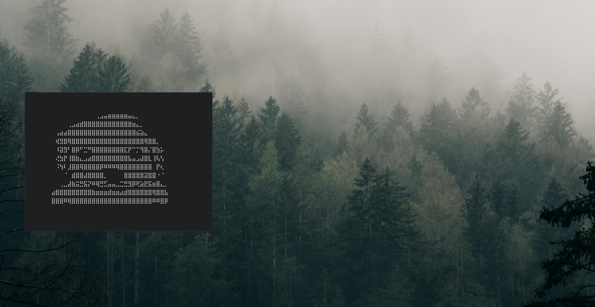

## Core Components
* **WM:** i3-gaps
* **Bar:** Polybar
* **Terminal:** Alacritty
* **Shell:** Fish (with auto-clear feature)
* **Launcher:** Rofi
* **Compositor:** Picom (animations enabled)

## External Themes
If you want the full look, you will need these:
* **GTK Theme:** [Everforest-BL-LB-Dark](https://www.pling.com/p/1695467/)
* **Icons:** [Ant-Dark](https://www.gnome-look.org/p/1464285)
* **Fonts:** CaskaydiaMono Nerd Font & Font Awesome 6
